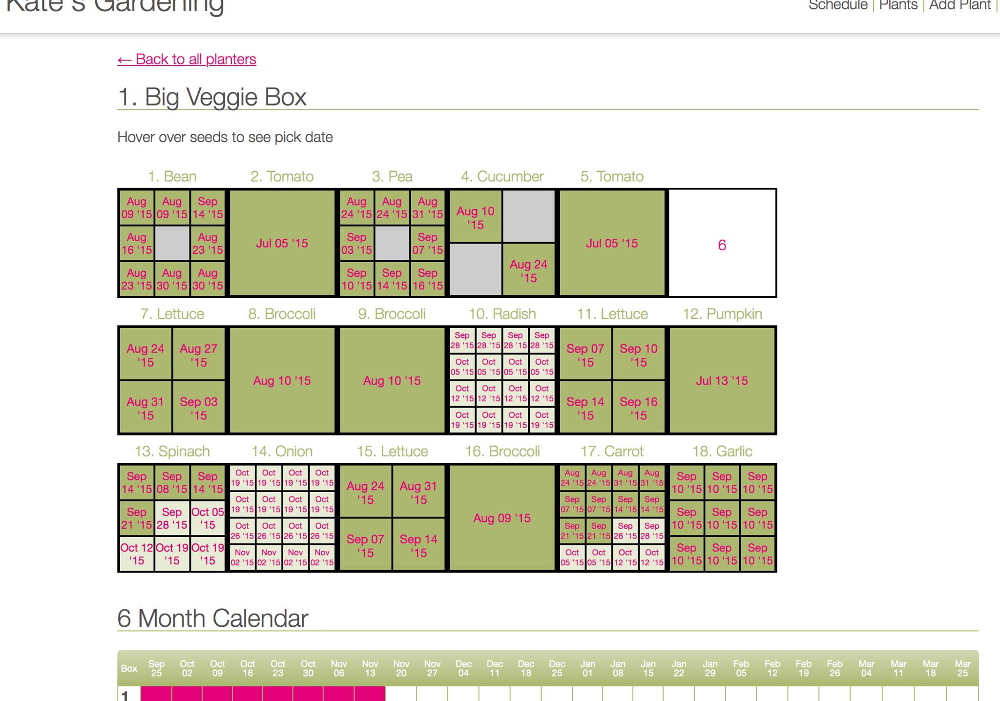
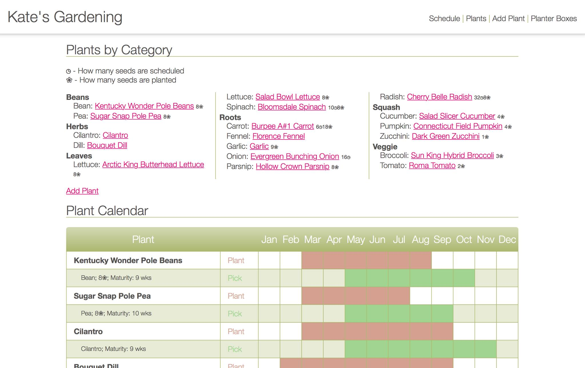

# Gardening App

## Description

A gardening app I wrote myself in Ruby on Rails that shows my planter boxes divided up into 1'x1' sections:

If you click on an empty section you can choose from a list of seeds and the app will know how many of that seed can go in each section. Enter in planting dates and the app will know when each seed should reach maturity. Database of seeds populates a calendar:

So I can easily scroll down and see which seeds would be good to plant at any given time. Above the calendar shows me a list of seeds I have on hand and how many I have scheduled to plant and how many are already planted, so I can make sure I have a variety of plants going at any time.

## Background

This was an extensive labor of love built after learning Ruby on Rails. I am always looking for ways to write programs to make my life easier and this one made my life both easier AND more fun. And helped give us lots of yummy veggies to eat!
